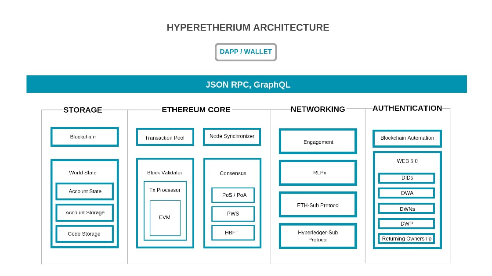

# EnterCoin Documentation

## What is Enter?

EnterChain is a fast, scalable, and secure blockchain platform built on HBFT (an IBFT2 consensus protocol).

**Hyperthereum** protocol allows EnterChain to be very fast yet secure blockchain system. It brings together the best of both Hyperledger and Ethereum; as Ethereum us becoming a technology standard.

EnterChain is:

* smart contracts permissions managed
* decentralized
* open-source
* user friendly

## Key features

### Speed

EnterChain achieves transactions finality in 5 second on average.

### Scalability

EnterChain can process thousands of transactions per seconds and can scale to hundreds of nodes.

### Permissioned

Enterprise grade security using on-chain permissions enforced by smart contracts.

### Security

Hyperthereum provides institutional-grade security to distributed networks. EnterChain offers absolute finality, which means that transactions can never be reverted like in networks with probabilistic finality.\
EnterChain is also leaderless. By removing leaders, security doesn’t rely on a small set of actors.

### Smart contract support

EnterChain is fully compatible with Ethereum. Developers can create and deploy smart contracts as they would on Ethereum.

### Blockchain-as-a-service

Hyperthereum can be used to create any kind of private and public distributed ledger, using EVM or Cosmos SDK.

### Blockchain for the masses

EnterChain is a platform to creating blockchain networks, both isolated and sidechains, with an easy to use user interface.
